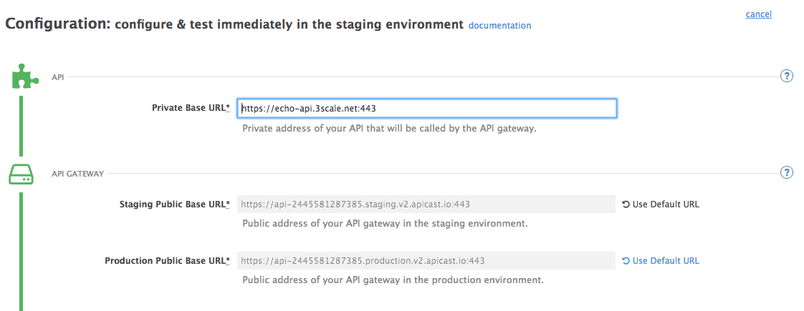

In this step, we’re going to integrate our service with 3scale. As an example, we’re going to use our ‘Echo API’ which is a simple REST API that returns back info about the request.

## Task 1
When you create an account on 3scale it comes with a service created by default. We’re going to use that same service to define and integrate our Echo API. Depending on your role and permissions you may be able to access/ create multiple services, but for the purpose of this tutorial, we’re going to stay with the default one.

To see the id of your service using the CLI, if you didn’t do it in the previous step, execute the following command:

`3scale-cli services list`{{execute}}

Save the id of the service, you'll need it in task 3.

## Task 2
The next step is to indicate the private host of your API.

By default, we’re going to be using APIcast hosted and API keys our authentication method. In real life, you could choose to change these from *Integration > Settings*.

First, log into your 3scale Admin portal:

- **URL**: [https://commandline-admin.3scale.net](https://commandline-admin.3scale.net)
- **Usename**: It was created at the beginning of the tutorial, you’ll find it in your terminal
- **Password**: password

Then go to *APIs > Overview > Integration* and add your host there, in our case:
`echo-api.3scale.net`

Your host will be kept private and won’t be accessible from the outside. Your partners and developers will use the public host which in this case is given to you because we’re using APIcast hosted.

You will obtain two public URLs, one for your staging environment and another one for your production environment:

Don’t forget to save your changes in staging before moving to the next task.

## Task 3
Now that we have the basics of our service, let’s create some methods and mapping rules. These can be created manually or automatically by importing an API definition (json file).

In this case, we have the Echo API definition - its format is Open API - saved in the *assets* folder and that is what we're going to use. We want to populate our existing service, so we'll have to specify the service id in the command like this:

`3scale-cli import swagger create -f ../assets/echo.json -s <service_id>`

If you go back to your Admin Portal, you'll see how all of the endpoints have been added as methods in the *Definition* page, and how the mapping rules have been created and are showing in the *Integration* page.

Time to configure access to our service!
